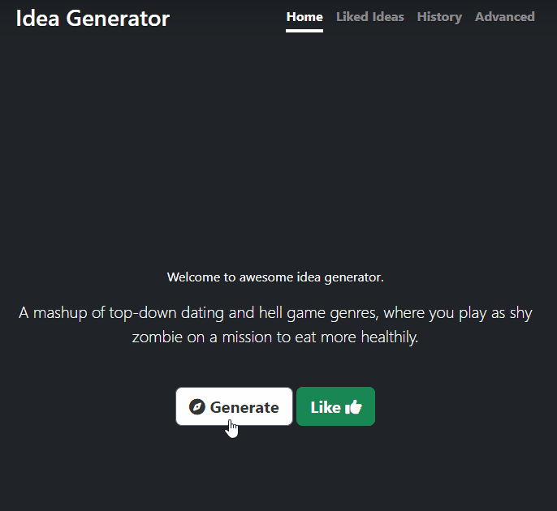
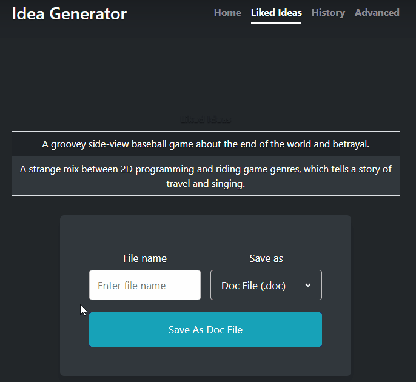
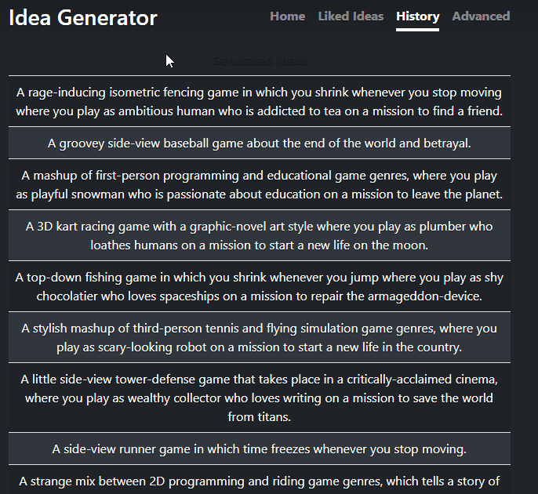
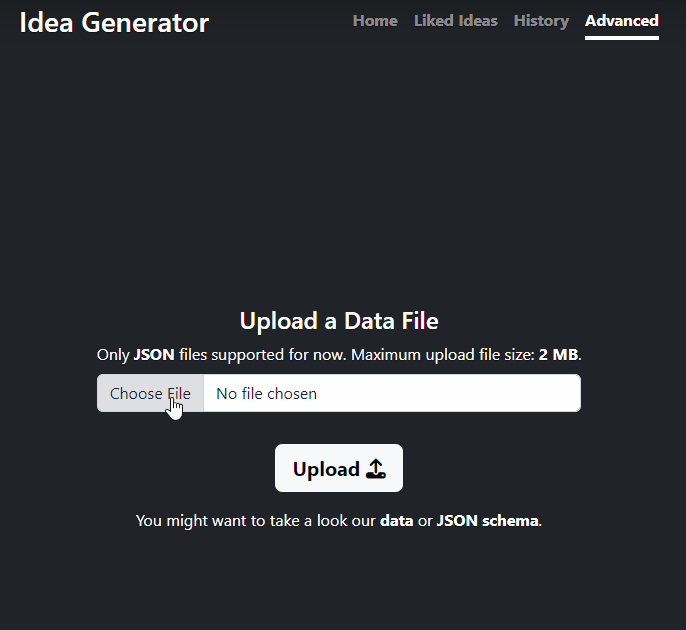

# Idea Generator

#### Video: https://youtu.be/W8xQl23NhHA

#### Description: A web-based application that generates random game ideas.

With this app, you can generate new random game ideas. The application uses JSON data for idea generation.

#### Table of Contents

 1. [Main Features](#main-features)
 2. [Core Idea](#core-idea)
 3. [Navigation](#navigation)
     - [Homepage](#homepage)
     - [Liked Ideas](#liked-ideas)
     - [History](#history)
     - [Advanced](#advanced)
 4. [Useful](#useful)

## Main Features

 - Generate random game ideas.
 - Upload your own custom data to generate specialized game ideas.
 - Download all the generated ideas or ideas you liked.

## Core Idea

I got the idea for this project from [Sebastian Lague](https://www.youtube.com/c/SebastianLague) and tried to improve it.

Sebastian uses javascript and HTML to create an idea generator [in this video](https://www.youtube.com/watch?v=--GB9qyZJqg&ab_channel=SebastianLague). I really liked this idea, and I wanted to push the concept forward using the power of Python.

## Navigation

#### Homepage:

 - You can generate brand new ideas by pressing the **"Generate"** button on the main screen.
 - If you like an idea you can save it by pressing the **"Like"** button.
 - You can navigate between the pages with the buttons in the top right corner.

 

#### Liked Ideas:

 - You can see the ideas you liked on this page.
 - You can **download the ideas you like** with the file saver at the bottom of the page.

  

#### History:

 - You can see all the ideas generated.
 - You can **download all the ideas** with file saver in the bottom of the page.

  

#### Advanced:

 -  You can upload custom data for idea generation.
 -  You can download/view helpful files to create custom data.

   

## Useful

Here you can download and see useful files for advanced usage of Idea Generator:

 - Default [JSON data](assets/docs/data.json)
 - Example [JSON data](assets/docs/example_data.json)
 - [JSON schema](assets/docs/data.schema.json)